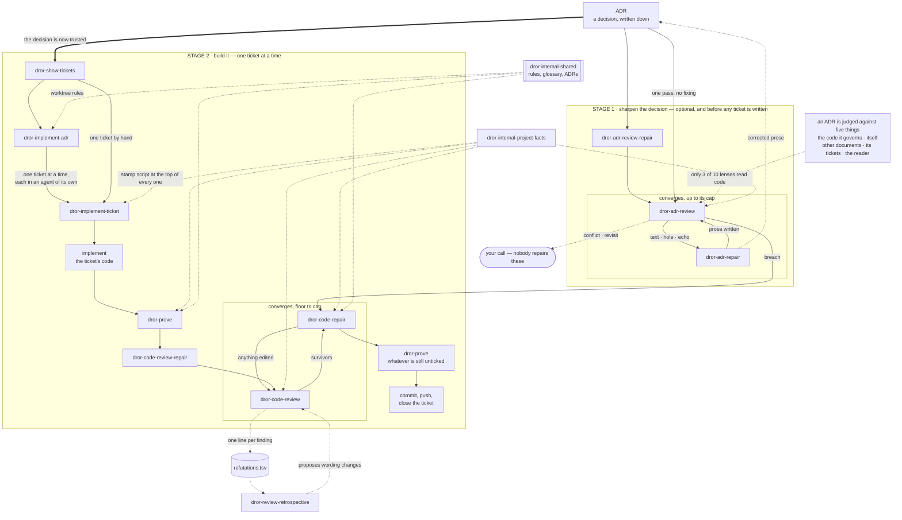

# Structure

Twenty skills over one way of working. Every description below is the skill's
own `description:` line, verbatim, minus its "Use when" trigger clause. This
file owns the "Reach for it when" voice — the human's index — and nothing else:
descriptions belong to each skill's frontmatter, and where this file and
[`DROR-SKILLS.md`](dror-internal-shared/DROR-SKILLS.md) state the same rule,
DROR-SKILLS.md owns it and this file mirrors.

## Four words, before anything else

If ADRs and tickets are already how you work, skip this section. If they are not,
these four words are the whole idea, and the skills are just machinery around
them.

**An ADR is a decision, written down before the code.** One short document per
decision: what was decided, and what it was chosen *over*. The alternative
matters as much as the choice — six months later, the question is never "what did
we do", it is "why didn't we do the obvious thing", and an ADR that skipped the
alternative cannot answer. They live as numbered files, `0007-*.md`, in a
decision directory — `docs/adr/` in this repo, wherever its own tool put them in
yours. They are prose: read start to finish, and still true after the work
ships.

**A spec issue turns one ADR into work.** It is the parent issue that says "this
decision is now being built". What it carries is the link back to the ADR and the
list of its children; the criteria live one level down, in the tickets.

**A ticket is one piece of that work.** A child issue of the spec issue, small
enough that one person, or one agent, can finish it in a sitting. Its number is
what you hand a skill: `dror-implement-ticket 42`.

**Acceptance criteria are the contract.** Checkboxes in the ticket's body:

```markdown
## Acceptance criteria

- [ ] An empty directory records nothing and is not an error
- [ ] A missing input file is refused by name, not silently skipped
- [ ] Opening the same file twice reads the cached index, not the source
```

Everything downstream is those lines and nothing else. `dror-prove` writes one
test per checkbox and ticks it only after seeing that test *fail* first.
`dror-code-review` judges the diff against them. `dror-code-repair` unticks one when its
test goes red again. A closed ticket means every box is ticked and every tick was
earned — which is why the criteria have to be written as things that can be
observed, not as intentions like "handles the edge cases properly".

That is the loop: **decide, split, agree what done means, then build until the
boxes are honestly ticked.** The skills below automate the parts of it that are
mechanical, and stop at the parts that are judgement.

## The names

`dror-` is a **namespace, not a category**. Installed skills share one flat `/`
list, so the prefix is what keeps these from colliding with another author's
`review` or `prove` — and what lets you see, at the moment you pick one, whose
opinion about reviewing you are about to run. `brief` and `screen-capture` sit
outside the namespace: each is a single-purpose tool, doing one thing on request,
and the plain name is the whole of what it offers.

Inside the namespace, `dror-internal-` marks a skill **another skill runs, not
you**. That is a second namespace and not a warning: the two are perfectly
runnable by hand, they just answer a question the chain asks rather than one you
would.

## The flow

One decision goes in at the top and finished, closed tickets come out at the
bottom. The two stages run in that order, and the first one is optional.



Solid arrows are the run order. The thick arrow is the hand-off between the two
stages. Dotted arrows are what each step reads or writes rather than where
control goes.

**Stage 1 is skippable and it is not free.** Skipping it is the ordinary choice
for a decision written this week; taking it is what you do before cutting tickets
from a decision the tree has moved under, because everything in stage 2 takes the
ADR on trust — the tickets are cut from it, the tests are written against its
criteria, the review judges the diff by them. A sentence that quietly stopped
being true becomes a rule broken by somebody following instructions correctly,
and by then the tickets are wrong too.

## Three pairs, one document type each

The same find-then-fix shape appears three times below, and the three are
deliberately **not** interchangeable. `dror-code-review` and `dror-code-repair`
work on code. `dror-adr-review` and `dror-adr-repair` work on decision records.
`dror-skill-review` and `dror-skill-repair` work on skills. Each pair
specialises in its own kind of document, and each repair skill is built to take
exactly what its own reviewer produces.

So a rule that is about *what settles a sentence here* belongs inside the pair
that needs it, in that pair's own words. A skill is a directory, so what the
directory holds is evidence for a skill repair; an ADR is one file, so it is
not evidence there. Identical wording across two pairs is not the goal, and a
skill that borrows its counterpart's definition is a defect — the borrowing
hides which pair the rule was written for, and a later sharpening in one pair
silently misses the other.

What the three pairs may share is the plumbing around them: the report store,
the log schemas, the finding-id shape, the ticket numbering. Those live once on
the shelf, in `dror-internal-shared/`, and every pair points at them. The
glossary in
[`dror-internal-shared/CONTEXT.md`](dror-internal-shared/CONTEXT.md) names a
term and says which file fixes its details; it does not fix them itself when
the details differ by document type.

## The chain

| Skill | Reach for it when | Description | Writes |
|---|---|---|---|
| `dror-show-tickets` | You are deciding what to do next, or want to know whether an ADR is finished. Read it before and after the rest. | Show one table of every ticket belonging to an ADR — whether it is closed, ready to close, ready or blocked, whether its code landed, and how many acceptance criteria are ticked. | nothing |
| `dror-implement-adr` | A whole ADR is ready and you want to leave it running — many tickets, one branch, no supervision between them. It is forked, so it says nothing until it finishes: watch the desktop notification it fires per ticket, or `tail -f` its progress log. | Work one ADR's ticket list to exhaustion on a branch of its own — a side worktree off the remote head, one ticket at a time through `dror-implement-ticket`, committed ticket by ticket, stopping for the user the moment a ticket raises a question only they can answer. | a worktree at `.claude/adr-wip/adr-<N>` (removed on a clean finish), a branch `adr-<N>`, a push and a close per ticket, the spec issue's close on a clean finish, a drain state file and a progress log |
| `dror-implement-ticket` | One ticket, start to closed, in the current tree. The default entry point — it runs the four below in order. | Take one ticket from unwritten to closed — implement it, prove its criteria, loop review and repair until it converges, prove whatever is still unticked, then commit, push and close it. | code, in one commit, pushed to its branch; then whatever the three below write |
| `dror-prove` | The code exists and you want to know whether its criteria are actually tested — or you wrote tests by hand and want them audited. | Prove a ticket's acceptance criteria with tests, one test per criterion, each seen to fail before it counts. | tests; ticks green boxes |
| `dror-code-review` | You want to know what is wrong before pushing, and you want to decide yourself what gets fixed. | Correctness review of the unpushed work — commits not yet on the remote plus the working tree — every finding tool-proven or refuted before it reaches you. Reports the survivors and changes no behaviour. | a review report, its per-criterion verdicts inside |
| `dror-code-repair` | Findings already exist — in a review report, or in a findings file you wrote from what a colleague or a conversation named — and you want them fixed with a failing test each. | Fix bugs already found, each one red before the fix and green after, and close named gaps in test cover. | code and tests; unticks a red box |
| `dror-code-review-repair` | Same as `dror-code-review`, but you want the fixing done too and do not want to be asked between rounds. Costs several times a single review. | Loop review and repair over the unpushed work until it converges — `dror-code-review`, then `dror-code-repair` on what survived, round after round while a round is still owed. | whatever its two steps write |

## Above the chain

The chain starts at an ADR and takes it on trust. These ask whether it deserves
it. They are the same shape one level up: find, then fix, in two runs, with the
finding refuted before it reaches you — and a loop over the two, as below.

| Skill | Reach for it when | Description | Writes |
|---|---|---|---|
| `dror-adr-review` | Before trusting an old decision — the tree has moved under it, or you are about to write tickets against it. | Review one ADR document against itself, its tickets and the code it governs — every finding refuted before it reaches you. Reports the survivors and edits no text. | a review report |
| `dror-adr-repair` | An ADR review returned `text`, `hole` or `echo` findings and you want the documents corrected without the decision being rewritten. | Repair an ADR's text from findings already made — every corrected sentence grounded in the code it describes, and no decision rewritten. | prose, wherever an `echo` says the rule is read — the ADR, the conventions doc, the glossary, a docstring |
| `dror-adr-review-repair` | Same as `dror-adr-review`, but you want the correcting done too and do not want to be asked between rounds — the usual way to sharpen an ADR before implementing it. | Loop ADR review and repair over one decision document until it converges — `dror-adr-review`, then `dror-adr-repair` on what survived, round after round while a round is still owed. | whatever its two steps write |

Findings divide by **kind** — six of them — because different hands fix them:
the routing for all six lives in
[`dror-internal-shared/DROR-SKILLS.md`](dror-internal-shared/DROR-SKILLS.md),
the definitions in the glossary.

## On the machinery itself

The same find-then-fix shape once more, turned on the skills in this repo —
every file here is read by an agent mid-run, so a skill drifts and misleads
exactly the way an ADR does, and the pair below reviews and repairs one skill's
directory the way the pair above treats one decision document. The kind
routing lives in
[`dror-internal-shared/DROR-SKILLS.md`](dror-internal-shared/DROR-SKILLS.md).

| Skill | Reach for it when | Description | Writes |
|---|---|---|---|
| `dror-skill-review` | Before editing a skill that has sat untouched while the repo moved, or when a run of it misbehaved and you want the text checked before blaming the model. | Review one skill against Anthropic's published rules for a skill, the harness contract, the tree it runs in, itself, the shelf and the agent that reads it — every finding refuted before it reaches you. Reports the survivors and edits no text. | a review report |
| `dror-skill-repair` | A skill review returned `text`, `hole`, `sprawl` or `echo` findings and you want the text corrected without the skill being redesigned. | Repair a skill's text from findings already made — every corrected sentence grounded in the file, command or directory it points at, restatements collapsed to pointers, every drifted copy synchronised, and no behaviour redesigned. | the skill's prose, and any index row, map entry or glossary line an `echo` names |
| `dror-skill-review-repair` | Same as `dror-skill-review`, but you want the correcting done too and do not want to be asked between rounds. | Loop skill review and repair over one skill until it converges — `dror-skill-review`, then `dror-skill-repair` on what survived, round after round while a round is still owed. | whatever its two steps write |

## Beside the chain

| Skill | Reach for it when | Description |
|---|---|---|
| `dror-review-retrospective` | After twenty-odd findings have accumulated and reviews start feeling noisy. Not after one bad run — one run's kills say nothing. | Read the review logs across runs and say what the lenses are getting wrong and what the rounds are worth — which lens produces false positives, which recurring assumption causes them, what a later round caught that an earlier one had in front of it, and what a round costs. Reports and stops. |
| `dror-internal-project-facts` | Rarely by hand — to see what the skills believe your repo declares, or to refresh it after changing your test setup. | Return this repo's domain vocabulary, verification commands, test layout, declared scope and issue convention. |
| `dror-skill-vendor-rules` | By hand, bare, when you want to know whether the guide moved and to be offered the refresh; on a weekly timer with `check`, which never offers anything. | Check whether the published guide behind the skill reviews' vendor baseline has been re-uploaded since that baseline was distilled, and re-distil it on request. Called bare it reports and then offers the refresh; called with check it only reports; called with refresh it rewrites the baseline and its stamp, unstaged, and never commits. |
| `dror-internal-shared` | Read it as documentation — the test-writing rules, the report store's rules, the ADR worktree's rules, the directory-override contract, the step-agent carrier, what a delegated skill's stop means to its caller, how an ADR number resolves to a file, the glossary, or the reasoning behind why a skill behaves as it does. | Reference material the `dror-*` skills read — the test-writing rules, the report store's rules, the ADR worktree's rules, the directory-override contract, the step-agent carrier, what a delegated skill's stop means to its caller, how an ADR number resolves to a file, the glossary, the map and the decision record. A shelf, read by the skills that run. |

The `dror-internal-` prefix means **another skill runs it, not you**.
`project-facts` opens every skill in the chain — its stamp script runs before
the skill's text is read and injects the cached facts, and the skill itself runs
only on a miss; `shared` is a shelf of documents those skills read as they work.

## What a run costs, and how to keep it down

Every skill in the chain runs in a context of its own: its frontmatter forks it,
so the conversation you invoke it from never reaches it and its working context
never reaches you — only its closing summary does. Two habits keep the bill
lower still. Invoke a chain skill right after `/clear`, since the session that
receives the summary pays for whatever it already holds on every turn until
then. And for a run nobody is watching — a drain, an overnight loop — start it
from a terminal instead: `claude -p "/dror-implement-adr 12" --permission-mode
acceptEdits`, which is the same run in a session that holds nothing else, and
returns any question the run stops on as its output for you to answer in the
next invocation. The reasons are ADR 0036.

The forks nest, and the harness caps how deep: an agent at the cap cannot
spawn, and a skill forked from just below it arrives without its arguments.
The chain stays under that ceiling by one fold — a drain-run
`dror-implement-ticket` follows `dror-code-review-repair`'s file in its own context
instead of forking it, keyed on the directory override in its arguments — so
every fork still gets its arguments and every review keeps its parallel
fan-out, whichever of the three entry points (`dror-implement-adr`,
`dror-implement-ticket`, `dror-code-review-repair`) you invoke yourself. The
reasons, and the depth arithmetic, are ADR 0043.

## Style and tools

These work at the level of the session itself: three change how answers come
back to you, one changes what Claude can see.

| Skill | Reach for it when | Description |
|---|---|---|
| `dror-guide` | An answer went over your head, or the next thing you must do is a sequence of steps outside the editor. | Answer as a step-by-step guide in plain words, assuming nothing. |
| `dror-brief-me` | A decision has landed in an area you have never worked in, and you need the ground before the options. | Bring the user up to speed on an area they have not worked in, then lay out the choice — background, the problem, the fact that settles it, each option with its cost, a recommendation. |
| `brief` | The replies have grown into essays and you want them cut back for the rest of the session. | Reset the answering style to terse plain speech — answer first, one or two short sentences, no lists. |
| `screen-capture` | The problem is something you can see and cannot paste — a GUI, a rendered plot, a dialog behaving oddly. | Capture the user's screen (or a specific monitor / region) to a PNG and view it, so Claude can see what is on screen and guide GUI steps. |

## Who may move a checkbox

One writer per direction, because a tick is a claim about evidence:

- **`dror-prove` ticks**, and only what it saw go green.
- **`dror-code-repair` unticks**, and only a box whose test it just saw go red.
- **`dror-code-review` touches no box.** Its per-criterion verdicts go into its own
  report; nothing is posted to the tracker.

## Which of them know your repo's conventions

- **Repo-agnostic** — `dror-internal-project-facts`, `dror-implement-ticket`,
  `dror-prove`, `dror-code-repair`, `dror-code-review`, `dror-code-review-repair`,
  `dror-adr-repair`, `dror-skill-repair`, `dror-guide`, `dror-brief-me`.
  They name no path and no tracker; whatever a repo declares reaches them
  through the facts.
- **Convention-bound** — `dror-show-tickets` and `dror-implement-adr` assume
  GitHub issues reachable by `gh`; `dror-show-tickets`, `dror-implement-adr`,
  `dror-adr-review` and `dror-adr-review-repair` assume ADRs in a conventional
  decision directory, resolved by the shelf's `ADR-FILE.md`; `dror-skill-review`
  assumes skills as directories holding a `SKILL.md`, resolved by the rule its
  own file states, and `dror-skill-review-repair` inherits that from it by
  taking a skill by name. In a repo that does
  neither, they say so and stop; a path named explicitly is always honoured.

The reasons behind all of it are one file per decision in
[`dror-internal-shared/docs/adr/`](dror-internal-shared/docs/adr/).
