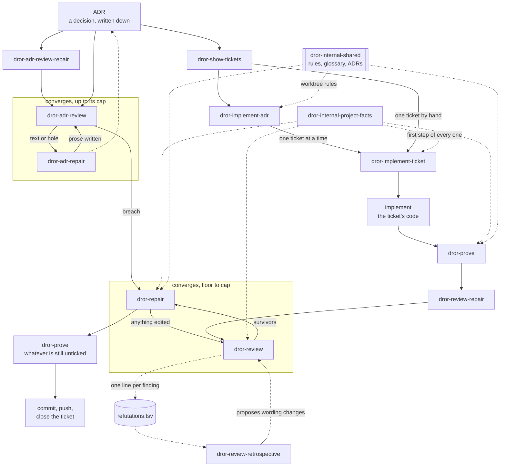

# Structure

Sixteen skills over one way of working. Every description below is the skill's
own `description:` line, verbatim, minus its "Use when" trigger clause. This
file owns the "Reach for it when" voice — the human's index — and nothing else:
descriptions belong to each skill's frontmatter, and where this file and
[`DROR-SKILLS.md`](dror-internal-shared/DROR-SKILLS.md) state the same rule,
DROR-SKILLS.md owns it and this file mirrors.

## Four words, before anything else

If ADRs and tickets are already how you work, skip this section. If they are not,
these four words are the whole idea, and the skills are just machinery around
them.

**An ADR is a decision, written down before the code.** One short document per
decision: what was decided, and what it was chosen *over*. The alternative
matters as much as the choice — six months later, the question is never "what did
we do", it is "why didn't we do the obvious thing", and an ADR that skipped the
alternative cannot answer. They live as numbered files, `docs/adr/0007-*.md`, and
they are prose — read start to finish, and still true after the work ships.

**A spec issue turns one ADR into work.** It is the parent issue that says "this
decision is now being built". What it carries is the link back to the ADR and the
list of its children; the criteria live one level down, in the tickets.

**A ticket is one piece of that work.** A child issue of the spec issue, small
enough that one person, or one agent, can finish it in a sitting. Its number is
what you hand a skill: `dror-implement-ticket 42`.

**Acceptance criteria are the contract.** Checkboxes in the ticket's body:

```markdown
## Acceptance criteria

- [ ] An empty directory records nothing and is not an error
- [ ] A missing input file is refused by name, not silently skipped
- [ ] Opening the same file twice reads the cached index, not the source
```

Everything downstream is those lines and nothing else. `dror-prove` writes one
test per checkbox and ticks it only after seeing that test *fail* first.
`dror-review` judges the diff against them. `dror-repair` unticks one when its
test goes red again. A closed ticket means every box is ticked and every tick was
earned — which is why the criteria have to be written as things that can be
observed, not as intentions like "handles the edge cases properly".

That is the loop: **decide, split, agree what done means, then build until the
boxes are honestly ticked.** The skills below automate the parts of it that are
mechanical, and stop at the parts that are judgement.

## The names

`dror-` is a **namespace, not a category**. Installed skills share one flat `/`
list, so the prefix is what keeps these from colliding with another author's
`review` or `prove` — and what lets you see, at the moment you pick one, whose
opinion about reviewing you are about to run. `brief` and `screen-capture` sit
outside the namespace: each is a single-purpose tool, doing one thing on request,
and the plain name is the whole of what it offers.

Inside the namespace, `dror-internal-` marks a skill **another skill runs, not
you**. That is a second namespace and not a warning: the two are perfectly
runnable by hand, they just answer a question the chain asks rather than one you
would.

## The flow



Solid arrows are the run order. Dotted arrows are what each step reads or writes
rather than where control goes.

## The chain

| Skill | Reach for it when | Description | Writes |
|---|---|---|---|
| `dror-show-tickets` | You are deciding what to do next, or want to know whether an ADR is finished. Read it before and after the rest. | Show one table of every ticket belonging to an ADR — whether it is closed, ready to close, ready or blocked, whether its code landed, and how many acceptance criteria are ticked. | nothing |
| `dror-implement-adr` | A whole ADR is ready and you want to leave it running — many tickets, one branch, no supervision between them. | Work one ADR's ticket list to exhaustion on a branch of its own — a side worktree off the remote head, one ticket at a time through `dror-implement-ticket`, committed ticket by ticket, stopping for the user the moment a ticket raises a question only they can answer. | a worktree at `.claude/adr-wip/adr-<N>` (removed on a clean finish), a branch `adr-<N>`, a push and a close per ticket, a drain state file |
| `dror-implement-ticket` | One ticket, start to closed, in the current tree. The default entry point — it runs the four below in order. | Take one ticket from unwritten to closed — implement it, prove its criteria, loop review and repair until it converges, prove whatever is still unticked, then commit, push and close it. | code, in one commit, pushed to its branch; then whatever the three below write |
| `dror-prove` | The code exists and you want to know whether its criteria are actually tested — or you wrote tests by hand and want them audited. | Prove a ticket's acceptance criteria with tests, one test per criterion, each seen to fail before it counts. | tests; ticks green boxes |
| `dror-review` | You want to know what is wrong before pushing, and you want to decide yourself what gets fixed. | Correctness review of the unpushed work — commits not yet on the remote plus the working tree — every finding refuted before it reaches you. Reports the survivors and changes no behaviour. | a review report, its per-criterion verdicts inside |
| `dror-repair` | Findings already exist — from a review, from this conversation, from a colleague — and you want them fixed with a failing test each. | Fix bugs already found, each one red before the fix and green after, and close named gaps in test cover. | code and tests; unticks a red box |
| `dror-review-repair` | Same as `dror-review`, but you want the fixing done too and do not want to be asked between rounds. Costs several times a single review. | Loop review and repair over the unpushed work until it converges — `dror-review`, then `dror-repair` on what survived, round after round while a round is still owed. | whatever its two steps write |

## Above the chain

The chain starts at an ADR and takes it on trust. These ask whether it deserves
it. They are the same shape one level up: find, then fix, in two runs, with the
finding refuted before it reaches you — and a loop over the two, as below.

| Skill | Reach for it when | Description | Writes |
|---|---|---|---|
| `dror-adr-review` | Before trusting an old decision — the tree has moved under it, or you are about to write tickets against it. | Review one ADR document against itself, its tickets and the code it governs — every finding refuted before it reaches you. Reports the survivors and edits no text. | a review report |
| `dror-adr-repair` | An ADR review returned `text`, `hole` or `echo` findings and you want the documents corrected without the decision being rewritten. | Repair an ADR's text from findings already made — every corrected sentence grounded in the code it describes, and no decision rewritten. | prose, wherever an `echo` says the rule is read — the ADR, the conventions doc, the glossary, a docstring |
| `dror-adr-review-repair` | Same as `dror-adr-review`, but you want the correcting done too and do not want to be asked between rounds — the usual way to sharpen an ADR before implementing it. | Loop ADR review and repair over one decision document until it converges — `dror-adr-review`, then `dror-adr-repair` on what survived, round after round while a round is still owed. | whatever its two steps write |

Findings divide by **kind** — six of them — because different hands fix them:
the routing for all six lives in
[`dror-internal-shared/DROR-SKILLS.md`](dror-internal-shared/DROR-SKILLS.md),
the definitions in the glossary.

## Beside the chain

| Skill | Reach for it when | Description |
|---|---|---|
| `dror-review-retrospective` | After twenty-odd findings have accumulated and reviews start feeling noisy. Not after one bad run — one run's kills say nothing. | Read the review log across runs and say what the lenses are getting wrong — which one produces false positives, which recurring assumption causes them, and what wording to change. Reports and stops. |
| `dror-internal-project-facts` | Rarely by hand — to see what the skills believe your repo declares, or to refresh it after changing your test setup. | Return this repo's domain vocabulary, verification commands, test layout, declared scope and issue convention. |
| `dror-internal-shared` | Read it as documentation — the test-writing rules, the report store's rules, the ADR worktree's rules, how an ADR number resolves to a file, the glossary, or the reasoning behind why a skill behaves as it does. | Reference material the `dror-*` skills read — the test-writing rules, the report store's rules, the ADR worktree's rules, how an ADR number resolves to a file, the glossary, the map and the decision record. A shelf, read by the skills that run. |

The `dror-internal-` prefix means **another skill runs it, not you**.
`project-facts` is the first step of every skill in the chain; `shared` is a
shelf of documents those skills read as they work.

## Style and tools

These work at the level of the session itself: two change how answers come back
to you, one changes what Claude can see.

| Skill | Reach for it when | Description |
|---|---|---|
| `dror-guide` | An answer went over your head, or the next thing you must do is a sequence of steps outside the editor. | Answer as a step-by-step guide in plain words, assuming nothing. |
| `brief` | The replies have grown into essays and you want them cut back for the rest of the session. | Reset the answering style to terse plain speech — answer first, one or two short sentences, no lists. |
| `screen-capture` | The problem is something you can see and cannot paste — a GUI, a rendered plot, a dialog behaving oddly. | Capture the user's screen (or a specific monitor / region) to a PNG and view it, so Claude can see what is on screen and guide GUI steps. |

## Who may move a checkbox

One writer per direction, because a tick is a claim about evidence:

- **`dror-prove` ticks**, and only what it saw go green.
- **`dror-repair` unticks**, and only a box whose test it just saw go red.
- **`dror-review` touches no box.** Its per-criterion verdicts go into its own
  report; nothing is posted to the tracker.

## Which of them know your repo's conventions

- **Repo-agnostic** — `dror-internal-project-facts`, `dror-implement-ticket`,
  `dror-prove`, `dror-repair`, `dror-review`, `dror-review-repair`,
  `dror-adr-repair`, `dror-guide`.
  They name no path and no tracker; whatever a repo declares reaches them
  through the facts.
- **Convention-bound** — `dror-show-tickets` and `dror-implement-adr` assume
  GitHub issues reachable by `gh`; `dror-show-tickets`, `dror-implement-adr`,
  `dror-adr-review` and `dror-adr-review-repair` assume ADRs in a conventional
  decision directory, resolved by the shelf's `ADR-FILE.md`. In a repo that does
  neither, they say so and stop; a path named explicitly is always honoured.

The reasons behind all of it are one file per decision in
[`dror-internal-shared/docs/adr/`](dror-internal-shared/docs/adr/).
