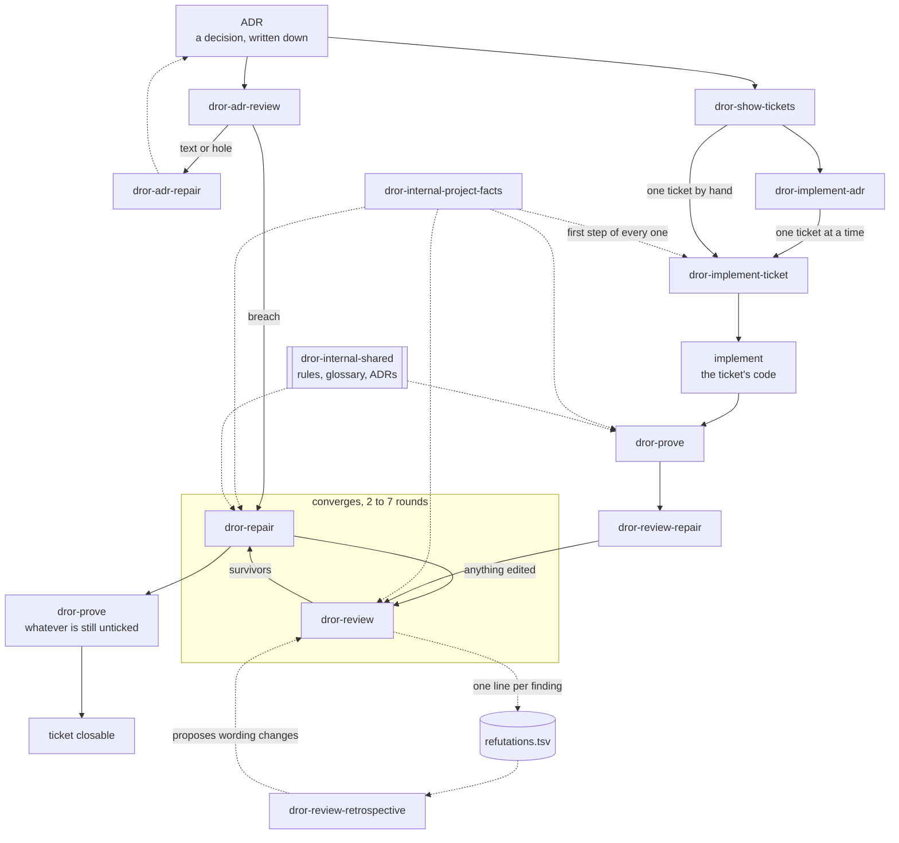

# Structure

Fifteen skills over one way of working. An **ADR** states a decision, a **spec
issue** turns it into work, **child tickets** carry the pieces, and each ticket's
**acceptance criteria** are checkboxes in its body. The criteria are the contract
— they are what a test is written against, what a review judges, and what a
closed ticket means.

Every description below is the skill's own `description:` line, verbatim.

## The names

`dror-` is a **namespace, not a category**. Installed skills share one flat `/`
list, so the prefix is what keeps these from colliding with another author's
`review` or `prove` — and what lets you see, at the moment you pick one, whose
opinion about reviewing you are about to run. `brief` and `screen-capture` carry
no prefix because they belong to no chain and claim no method.

Inside the namespace, `dror-internal-` marks a skill **another skill runs, not
you**. That is a second namespace and not a warning: the two are perfectly
runnable by hand, they just answer a question the chain asks rather than one you
would.

## The flow

Solid arrows are the run order. Dotted arrows are what each step reads or writes
rather than where control goes.

## The chain

| Skill | Description | Writes |
|---|---|---|
| `dror-show-tickets` | Show one table of every ticket belonging to an ADR — whether it is closed, ready to close, ready or blocked, whether its code landed, and how many acceptance criteria are ticked. | nothing |
| `dror-implement-adr` | Work one ADR's ticket list to exhaustion on a branch of its own — a side worktree off the remote head, one commit per ticket, `dror-implement-ticket` for each. | a worktree, a branch, one commit per ticket |
| `dror-implement-ticket` | Take one ticket from unwritten to closable — implement it, prove its criteria, loop review and repair until it converges, then prove whatever is still unticked. | code, then whatever the three below write |
| `dror-prove` | Prove a ticket's acceptance criteria with tests, one test per criterion, each seen to fail before it counts. | tests; ticks green boxes |
| `dror-review` | Correctness review of the unpushed work — commits not yet on the remote plus the working tree — every finding refuted before it reaches you. | a review report; a per-criterion comment |
| `dror-repair` | Fix bugs already found, each one red before the fix and green after, and close named gaps in test cover. | code and tests; unticks a red box |
| `dror-review-repair` | Loop review and repair over the unpushed work until it converges — round after round while a round is still owed, at least two and up to seven. | whatever its two steps write |

## The pair above the chain

The chain starts at an ADR and takes it on trust. These two ask whether it
deserves it. They are the same shape one level up: find, then fix, in two runs,
with the finding refuted before it reaches you.

| Skill | Description | Writes |
|---|---|---|
| `dror-adr-review` | Review one ADR document against the code it decides about — every finding refuted before it reaches you. Reports the survivors and edits no text. | a review report |
| `dror-adr-repair` | Repair an ADR's text from findings already made — every corrected sentence grounded in the code it describes, and no decision rewritten. | the ADR's prose, and nothing else |

Findings divide by **kind**, because two different hands fix them: a `text` or
`hole` is the document's fault and goes to `dror-adr-repair`; a `breach` is the
code's and goes to `dror-repair`; a `conflict` between two decisions is nobody's
until the user says which wins.

## Beside the chain

| Skill | Description |
|---|---|
| `dror-review-retrospective` | Read the review log across runs and say what the lenses are getting wrong — which one produces false positives, which recurring assumption causes them, and what wording to change. Reports and stops. |
| `dror-internal-project-facts` | Return this repo's domain vocabulary, verification commands, test layout, declared scope and issue convention. |
| `dror-internal-shared` | Reference material the `dror-*` skills read — the test-writing rules, the glossary, the map and the decision record. Not a procedure; nothing runs it on its own. |

The `dror-internal-` prefix means **another skill runs it, not you**.
`project-facts` is the first step of every skill in the chain; `shared` is a
shelf and has no procedure at all.

## Style and tools

These belong to no chain and read no store.

| Skill | Description |
|---|---|
| `dror-guide` | Answer as a step-by-step guide in plain words, assuming nothing. |
| `brief` | Reset the answering style to terse plain speech — answer first, one or two short sentences, no lists. |
| `screen-capture` | Capture the user's screen (or a specific monitor / region) to a PNG and view it, so Claude can see what is on screen and guide GUI steps. |

## Who may move a checkbox

One writer per direction, because a tick is a claim about evidence:

- **`dror-prove` ticks**, and only what it saw go green.
- **`dror-repair` unticks**, and only a box whose test it just saw go red.
- **`dror-review` touches no box.** It posts its per-criterion verdicts as a
  comment instead.

## Which of them know your repo's conventions

- **Repo-agnostic** — `dror-internal-project-facts`, `dror-implement-ticket`,
  `dror-prove`, `dror-repair`, `dror-review`, `dror-adr-repair`, `dror-guide`.
  They name no path and no tracker; whatever a repo declares reaches them
  through the facts.
- **Convention-bound** — `dror-show-tickets` and `dror-implement-adr` assume
  GitHub issues reachable by `gh`; `dror-show-tickets`, `dror-implement-adr` and
  `dror-adr-review` assume ADRs at `docs/adr/<NNNN>-*.md`. In a repo that does
  neither, they say so and stop; a path named explicitly is always honoured.

The reasons behind all of it are one file per decision in
[`dror-internal-shared/docs/adr/`](dror-internal-shared/docs/adr/).
